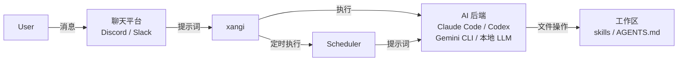

**中文** | [English](README.en.md)

# xangi

> **A**I **N**EON **G**ENESIS **I**NTELLIGENCE

以 Claude Code / Codex / Gemini CLI / 本地 LLM 为后端，可通过 Discord / Slack 使用的 AI 助手。推荐使用 Discord。

## 功能特性

- 支持多后端（Claude Code / Codex / Gemini CLI / 本地 LLM）
- 通过 `/backend` 命令，可按频道动态切换后端、模型和 effort 参数
- 支持本地 LLM（Ollama/vLLM 等，可切换代理模式/聊天模式）
- 支持 Discord / Slack / Web UI
- 支持 Docker
- 技能系统
- 调度器（cron / 单次 / 启动时任务）
- 会话持久化

## 架构



## 快速开始

### 1. 设置环境变量

```bash
cp .env.example .env
```

**最低限度配置（.env）:**
```bash
# Discord Bot Token（必需）
DISCORD_TOKEN=your_discord_bot_token

# 允许的用户 ID（必需，多个用逗号分隔，"*" 表示允许所有人）
DISCORD_ALLOWED_USER=123456789012345678
```

> 💡 工作目录默认为 `./workspace`。如需更改，请设置 `WORKSPACE_PATH`。

> 💡 关于 Discord Bot 的创建方法和 ID 的查询方式，请参考 [Discord 设置](docs/discord-setup.md)

### 2. 构建・启动

```bash
# 需要 Node.js 22+ 以及所使用的 AI CLI
# Claude Code: curl -fsSL https://claude.ai/install.sh | bash
# Codex CLI:   npm install -g @openai/codex
# Gemini CLI:  npm install -g @google/gemini-cli
# 本地 LLM:   安装 Ollama (https://ollama.com)

npm install
npm run build
npm start

# 开发时
npm run dev
```

### 3. 运行确认

请在 Discord 中 @提及 bot 并与其对话。

### 自动重启（pm2）

xangi 可以通过 `/restart` 命令重启。要实现自动恢复，需要使用进程管理器。

```bash
npm install -g pm2
pm2 start "npm start" --name xangi
pm2 restart xangi  # 手动重启
pm2 logs xangi     # 查看日志
```

## 使用方法

### 基本操作
- `@xangi 问题内容` - 通过 @提及 触发响应
- 设置专用频道时，无需 @提及

### 主要命令

| 命令 | 说明 |
|----------|------|
| `/new` | 开始新会话 |
| `/clear` | 清除会话历史 |
| `/stop` | 停止正在执行的任务 |
| `/settings` | 显示当前设置 |
| `xangi-cmd schedule_*` | 调度器（定时执行・提醒） |
| `xangi-cmd discord_*` | Discord 操作（获取历史记录・发送消息・搜索等） |

响应消息中会显示按钮（停止 / 新会话）。设置 `DISCORD_SHOW_BUTTONS=false` 可隐藏。

详情请参考 [使用指南](docs/usage.md)。

## 使用 Docker 运行

如果需要在容器隔离环境中运行，也可以使用 Docker。

```bash
# Claude Code 后端
docker compose up xangi -d --build

# 本地 LLM 后端（Ollama）
docker compose up xangi-max -d --build

# GPU 版（CUDA + Python + PyTorch）
docker compose up xangi-gpu -d --build
```

详情请参考 [使用指南: Docker 运行](docs/usage.md#docker运行)。

## 环境变量

### 必需

| 变量 | 说明 |
|------|------|
| `DISCORD_TOKEN` | Discord Bot Token |
| `DISCORD_ALLOWED_USER` | 允许的用户 ID（多个用逗号分隔，`*` 表示允许所有人） |

所有环境变量（包括可选项）请参考 [使用指南](docs/usage.md#环境变量列表)。

## 工作区

推荐工作区: [ai-assistant-workspace](https://github.com/karaage0703/ai-assistant-workspace)

这是一个预置了技能（备忘录管理・日记・语音转文字・Notion 联动等）的启动套件。通过与 xangi 结合，可以从聊天中调用技能，实现日常任务的自动化。

## 书籍

📖 [融入生活的 AI — 用 AI 代理打造属于自己的助手](https://karaage0703.booth.pm/items/8027277)

这是一本总结了使用 xangi 构建 AI 助手相关经验的书籍。

## 文档

- [使用指南](docs/usage.md) - Docker 运行・环境变量・本地 LLM・故障排除
- [Discord 设置](docs/discord-setup.md) - Bot 创建・ID 确认方法
- [Slack 设置](docs/slack-setup.md) - Slack 联动
- [设计文档](docs/design.md) - 架构・设计思想・数据流

## 致谢

xangi 的概念受到了 [OpenClaw](https://github.com/openclaw/openclaw) 的影响。

## 许可证

MIT
