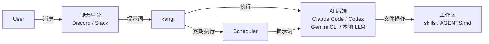

以下是该设计文档的中文翻译：

```markdown
# 设计文档

说明 xangi 的架构和设计思想。

## 概述

xangi 是一个“使得 AI CLI（Claude Code / Codex CLI / Gemini CLI）或本地 LLM（Ollama 等）能够从聊天平台使用的包装器”。

```
用户 → 聊天平台 (Discord/Slack) → xangi → AI CLI → 工作区
```

## 架构



### 层构成

| 层 | 职责 | 实现 |
|----------|------|------|
| 聊天平台 | 用户界面 | Discord.js, Slack Bolt |
| xangi | AI CLI 的集成与控制 | index.ts, agent-runner.ts, dynamic-runner.ts |
| 后端解析 | 按频道切换后端 | backend-resolver.ts, settings.ts |
| AI CLI | 实际的 AI 处理 | Claude Code, Codex CLI, Gemini CLI, 本地 LLM |
| 工作区 | 文件与技能 | skills/, AGENTS.md |

## 组件

### 入口点（index.ts）

主协调器。集成以下功能：

- Discord/Slack 客户端的初始化
- 消息接收与路由
- AI CLI 的调用
- 调度器的管理
- 命令处理（通过 `xangi-cmd` CLI 工具 + 文本解析）

### 代理运行器（agent-runner.ts）

抽象化 AI CLI 的接口：

```typescript
interface AgentRunner {
  run(prompt: string, options?: RunOptions): Promise<RunResult>;
  runStream(prompt: string, callbacks: StreamCallbacks, options?: RunOptions): Promise<RunResult>;
}
```

### 动态运行器管理器（dynamic-runner.ts）

按频道动态切换后端、模型和 effort 的包装器：

```
接收消息
  → BackendResolver.resolve(channelId)
  → 获取 { backend, model, effort }
  → DynamicRunnerManager 路由到适当的运行器
  → 执行
```

BackendResolver 的优先级：
1. 通过 `/backend set` 设置的 channelOverrides（内存中，持久化到 `.env` 的 `CHANNEL_OVERRIDES`）
2. `.env` 的默认值（`AGENT_BACKEND`, `AGENT_MODEL`）

### 系统提示词（base-runner.ts）

管理 xangi 注入到 AI CLI 的系统提示词：

- **聊天平台信息** — 告知 AI 这是通过 Discord/Slack 进行的对话的简短固定文本
- **XANGI_COMMANDS** — 从 `src/prompts/` 根据平台注入相应的命令规范
  - 通用命令（`xangi-commands-common.ts`）：超时对策等
  - 聊天平台通用（`xangi-commands-chat-platform.ts`）：文件发送（MEDIA:）、分隔符（===）、日程、系统命令
  - Discord 专用（`xangi-commands-discord.ts`）：`xangi-cmd discord_*` CLI 工具、自动展开
  - Slack 专用（`xangi-commands-slack.ts`）：Slack 特有的操作
  - 平台自动判别：仅 Discord 启用时只注入 Discord 专用命令（节省 token）
- **平台标识** — 为每条消息注入 `[平台: Discord]` 或 `[平台: Slack]`，让 AI 区分使用适当的命令

AGENTS.md / CHARACTER.md / USER.md 等工作区配置，委托给各 AI CLI 的自动加载功能：

| CLI | 自动加载文件 | 注入方式 |
|-----|---------------------|----------|
| Claude Code | `CLAUDE.md` | `--append-system-prompt`（一次性） |
| Codex CLI | `AGENTS.md` | 通过 `<system-context>` 标签嵌入 |
| Gemini CLI | `GEMINI.md` | CLI 侧自动加载（xangi 不注入） |
| 本地 LLM | `AGENTS.md`, `MEMORY.md` | 直接嵌入系统提示词（`CLAUDE.md` 通常是 `AGENTS.md` 的符号链接，因此排除） |

### AI CLI 适配器

| 文件 | 对应 CLI | 特点 |
|----------|---------|------|
| claude-code.ts | Claude Code | 支持流式、会话管理 |
| persistent-runner.ts | Claude Code（常驻） | 使用 `--input-format=stream-json` 实现常驻进程化、队列管理、断路器 |
| codex-cli.ts | Codex CLI | OpenAI 出品，支持 0.98.0 版本、支持 cancel |
| gemini-cli.ts | Gemini CLI | Google 出品，会话管理、支持流式 |
| local-llm/runner.ts | 本地 LLM | 直接调用 Ollama 等本地 LLM，支持工具执行和流式 |

#### 本地 LLM 适配器详细设计

**会话重试流程：**

```
1. 将用户消息添加到会话历史
   ↓
2. 向 LLM API 发送请求
   ↓
3a. 成功 → 返回工具循环或最终响应
3b. 发生错误
   ↓
4. 通过 isSessionRelatedError() 判断错误类型
   - context length exceeded / too many tokens / max_tokens / context window
   - invalid message / malformed / 400 / 422
   ↓
5a. 会话相关错误 → 清除会话（仅保留最后一条用户消息）→ 重试
5b. 非会话相关错误 → 通过 formatLlmError() 生成面向用户的错误消息并返回
   ↓
6. 重试也失败 → 通过 formatLlmError() 返回错误消息
```

**错误处理设计：**

- `isSessionRelatedError()` — 将 Error 实例的消息转换为小写，判断是否匹配与会话历史相关的已知模式。非 Error 对象始终返回 false
- `formatLlmError()` — 将连接错误、超时、认证错误、速率限制、服务器错误分别转换为易于理解的日文/中文消息。对于非 Error 对象返回默认消息
- 上下文修剪（`trimSession()`）— 在保护最近消息的前提下，执行工具结果截断、消息数量限制（MAX_SESSION_MESSAGES）、总字符数限制（CONTEXT_MAX_CHARS）

### 调度器（scheduler.ts）

管理定时执行和提醒：

```
┌─────────────────────────────────────────────────────┐
│ 调度器                                               │
├─────────────────────────────────────────────────────┤
│ - schedules: Schedule[]     # 日程数据               │
│ - cronJobs: Map<id, CronJob> # 正在执行的 cron 任务  │
│ - senders: Map<platform, fn> # 消息发送函数          │
│ - agentRunners: Map<platform, fn> # AI 执行函数     │
├─────────────────────────────────────────────────────┤
│ + add(schedule): Schedule                          │
│ + remove(id): boolean                              │
│ + toggle(id): Schedule                             │
│ + list(): Schedule[]                               │
│ + startAll(): void                                 │
│ + stopAll(): void                                  │
└─────────────────────────────────────────────────────┘
```

**日程类型：**
- `cron`: 基于 cron 表达式的定时执行
- `once`: 一次性提醒（在指定时间执行一次）

**持久化：**
- JSON 文件（`${DATA_DIR}/schedules.json`）
- 监听文件变化并自动重新加载（带防抖）

**时区：**
- 遵循服务器的系统时区（`TZ` 环境变量）
- 在 Docker 环境中，建议设置 `TZ=Asia/Tokyo` 等

### 工具服务器（tool-server.ts）

为 AI CLI 提供调用 xangi 功能（Discord 操作、日程、系统）的 HTTP API 服务器。

```
AI CLI（Claude Code 等）
  → xangi-cmd（Shell 脚本）
  → HTTP POST http://localhost:<port>/api/execute
  → tool-server（xangi 进程内）
  → Discord REST API / 调度器 / 设置
```

**端口管理：**
- 绑定端口 0（操作系统自动分配，多实例无冲突）
- 将启动后的 URL 作为 `XANGI_TOOL_SERVER` 注入子进程
- `xangi-cmd` 使用 `XANGI_TOOL_SERVER` 进行连接
- 当前频道 ID 等执行上下文通过 HTTP 请求的 `context` 字段传递给 tool-server

**安全性：**
- DISCORD_TOKEN 等密钥仅存在于 xangi 进程内部
- 通过 `safe-env.ts` 的白名单，仅向 AI CLI 传递安全的环境变量
- 在 Docker 环境中，通过容器隔离使得物理上无法访问令牌

### 技能系统（skills.ts）

从工作区的 `skills/` 目录读取技能，并注册为斜杠命令。

```
skills/
├── my-skill/
│   ├── SKILL.md      # 技能定义
│   └── scripts/      # 执行脚本
└── another-skill/
    └── SKILL.md
```

## 数据流

### 消息处理流程

```
1. 用户发送消息
   ↓
2. Discord/Slack 客户端接收
   ↓
3. 权限检查（allowedUsers）
   ↓
4. 特殊命令判定
   - /command → 斜杠命令处理
   ↓
5. 附加频道信息、发言者信息
   ↓
6. 转发给 AI CLI（processPrompt）
   ↓
7. 响应处理
   - 流式显示
   - 提取文件附件（MEDIA: 模式）
   - 检测 SYSTEM_COMMAND
   ↓
8. 回复用户
```

### 日程执行流程

```
1. cron/定时器触发
   ↓
2. Scheduler.executeSchedule()
   ↓
3. agentRunner(prompt, channelId)
   - 通过 AI CLI 执行提示词
   ↓
4. sender(channelId, result)
   - 将结果发送到频道
   ↓
5. 一次性任务自动删除
```

## 设计思想

### 用户管理

xangi 的用户管理采用简单的白名单方式：

- 通过 `DISCORD_ALLOWED_USER` / `SLACK_ALLOWED_USER` 进行访问控制
- 支持逗号分隔指定多个用户，`*` 表示允许所有人
- 会话按频道单位进行管理
- 发言者信息（显示名称、Discord ID）会自动注入到提示词中

### AI CLI 的抽象化

隐藏 AI CLI 的实现细节，使其可互换：

```typescript
// 通过配置切换后端
AGENT_BACKEND=claude-code  # 或 codex 或 gemini 或 local-llm
```

即使将来出现新的 AI CLI，只需添加适配器即可支持。

### 命令的自主执行

检测 AI 输出的特殊命令并自动执行：

| 方式 | 命令示例 | 动作 |
|------|----------|------|
| CLI 工具 | `xangi-cmd discord_send --channel ID --message "..."` | Discord 操作 |
| CLI 工具 | `xangi-cmd schedule_add --input "每天 9:00 ..."` | 日程操作 |
| CLI 工具 | `xangi-cmd system_restart` | 进程重启 |
| 文本解析 | `MEDIA:/path/to/file` | 发送文件 |
| 文本解析 | `\n===\n` | 消息分割 |

CLI 工具（`xangi-cmd`）通过 xangi 内置的 tool-server（HTTP 端点）执行。
DISCORD_TOKEN 等密钥被封闭在 xangi 进程内，AI CLI 无法访问。

### 持久化策略

| 数据 | 保存位置 | 格式 |
|--------|--------|------|
| 日程 | `${DATA_DIR}/schedules.json` | JSON |
| 运行时设置 | `${WORKSPACE}/settings.json` | JSON |
| 会话 | `${DATA_DIR}/sessions.json` | JSON（appSessionId 方式，activeByContext + sessions） |
| 转录日志 | `logs/sessions/{appSessionId}.jsonl` | JSONL（按会话的对话日志） |

### 会话管理

使用 xangi 独有的 `appSessionId` 管理会话。后端的 `providerSessionId`（如 Claude Code 的）事后附加保存。

**sessions.json 的结构：**
```json
{
  "activeByContext": { "<contextKey>": "<appSessionId>" },
  "sessions": {
    "<appSessionId>": {
      "id": "<appSessionId>",
      "title": "...",
      "platform": "discord|slack|web",
      "contextKey": "<channelId>",
      "agent": { "backend": "claude-code", "providerSessionId": "..." }
    }
  }
}
```

### 转录日志

将会话单位的 AI 对话日志自动保存为 JSONL 格式。用于调试、故障分析、Web UI 浏览。

**目录结构：**
```
logs/sessions/
  m4abc123_def456.jsonl   # 会话单位的日志
  m4xyz789_ghi012.jsonl
```

**记录的内容：**
- `user`: 用户发送的提示词
- `assistant`: AI 的最终响应
- `error`: 超时、API 错误等

**注意事项：**
- 日志已被 `.gitignore` 排除
- 自动轮换（按日期分割目录）
- 日志写入失败时忽略（不影响主体运行）

## 文件结构

```
bin/
└── xangi-cmd           # CLI 包装器（Shell 脚本，中继到 tool-server）

src/
├── index.ts            # 入口点、Discord 集成
├── slack.ts            # Slack 集成
├── agent-runner.ts     # AI CLI 接口
├── base-runner.ts      # 系统提示词生成
├── claude-code.ts      # Claude Code 适配器（per-request）
├── persistent-runner.ts # Claude Code 适配器（常驻进程）
├── codex-cli.ts        # Codex CLI 适配器
├── gemini-cli.ts       # Gemini CLI 适配器
├── web-chat.ts         # Web 聊天 UI（HTTP 服务器）
├── tool-server.ts      # 工具服务器（面向 AI CLI 的 HTTP API）
├── approval-server.ts  # 审批服务器（危险命令检测、交互式审批）
├── safe-env.ts         # 环境变量白名单
├── cli/                # CLI 模块（由 tool-server 调用）
│   ├── discord-api.ts  #   直接调用 Discord REST API
│   ├── schedule-cmd.ts #   日程操作
│   ├── system-cmd.ts   #   系统操作
│   └── xangi-cmd.ts    #   Node.js 版 CLI 入口点
├── local-llm/          # 本地 LLM 适配器
│   ├── runner.ts       #   主运行器（会话管理、工具执行循环）
│   ├── llm-client.ts   #   LLM API 客户端（Ollama native + OpenAI 兼容）
│   ├── context.ts      #   工作区上下文加载
│   ├── tools.ts        #   内置工具（exec/read/web_fetch）
│   ├── xangi-tools.ts  #   xangi 专用工具（function calling 版）
│   └── types.ts        #   类型定义
├── prompts/            # 提示词定义
│   ├── xangi-commands.ts          # 按平台组装
│   ├── xangi-commands-common.ts   # 通用（超时等）
│   ├── xangi-commands-chat-platform.ts # 聊天平台通用（MEDIA:/日程/系统）
│   ├── xangi-commands-discord.ts  # Discord 专用（xangi-cmd discord_*）
│   └── xangi-commands-slack.ts    # Slack 专用
├── scheduler.ts        # 调度器
├── skills.ts           # 技能加载器
├── config.ts           # 配置加载
├── settings.ts         # 运行时设置
├── sessions.ts         # 会话管理
├── file-utils.ts       # 文件操作工具
├── process-manager.ts  # 进程管理
├── runner-manager.ts   # 多频道同时处理（RunnerManager）
└── transcript-logger.ts # 按会话的转录日志
```

## Docker 构成

### 容器构成

```
┌─────────────────────────────────────────┐
│ xangi-max / xangi-gpu 容器              │
├─────────────────────────────────────────┤
│ - Node.js 22 + AI CLI + uv + Python    │
│ - xangi-gpu 还包含 CUDA + PyTorch      │
└───────────────┬─────────────────────────┘
                │ docker network
┌───────────────▼─────────────────────────┐
│ ollama 容器                              │
├─────────────────────────────────────────┤
│ - Ollama 官方镜像                        │
│ - GPU 直通                              │
│ - 通过 ollama:11434 连接               │
└─────────────────────────────────────────┘

┌─────────────────────────────────────────┐
│ llama-server 容器（可选）                │
├─────────────────────────────────────────┤
│ - llama.cpp 官方镜像                    │
│ - GPU 直通                              │
│ - 通过 llama-server:18080 连接         │
└─────────────────────────────────────────┘
```

### 安全策略

- 以非 root 用户（UID 1000）执行
- 仅挂载工作区
- 传递给 AI 代理的环境变量通过白名单方式限制（`src/safe-env.ts`）
- 无法直接访问主机网络（仅通过 ollama 容器）

详细内容（环境变量列表、Docker 操作方法等）请参考 [使用指南](usage.md)。

## 扩展点

### 添加新的聊天平台

1. 添加客户端初始化代码
2. 实现消息处理器
3. 通过 `scheduler.registerSender()` 注册发送函数
4. 通过 `scheduler.registerAgentRunner()` 注册 AI 执行函数

### 添加新的 AI CLI

1. 实现 `AgentRunner` 接口
2. 在 `config.ts` 中添加后端配置
3. 在 `index.ts` 中添加初始化处理
```
